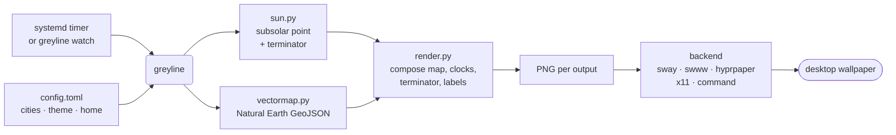

# Architecture

A scheduler runs `greyline` once a minute. It renders one PNG per output, hands each to
the detected backend, and exits. There is no daemon and no browser.

- `sun.py` computes the subsolar point and the terminator and twilight boundary
  latitudes. Pure astronomy, no I/O.
- `geo.py` and `vectormap.py` project lon/lat to pixels and draw the map from Natural
  Earth GeoJSON, supersampled so coastlines come out smooth at any resolution.
- `render.py` composites the map and overlays, then draws the clocks at native
  resolution, placing each label on whichever side avoids its neighbours and the edges.
- `backends/` is the only platform-specific code. Everything else is portable, which is
  why the same renderer runs in CI on Windows and macOS and in the browser demo.
- `helptext.py` renders the `greyline help <topic>` reference pages from the same data
  the renderer uses, so they cannot describe a version of greyline that does not exist.

## Design constraints

greyline optimises for universal compatibility, then performance and battery life, then
staying small. In that order. The consequences are worth stating outright, because they
are the reason for several things greyline deliberately does not do:

**No daemon.** A tick renders a PNG, hands it to your existing wallpaper mechanism, and
the process ends. Nothing stays resident between ticks.

**No real-time updates or animation.** A clock accurate to the minute is the contract.
Per-second redraws would cost battery and buy nothing you can read.

**No unbounded files or caches.** Artifacts are bounded and self-managing. The KDE
refresh fix ping-pongs two fixed buffers rather than writing a new timestamped file every
minute, and that is the shape every such fix should take.

**Desktop quirks get solved at the edge.** Prefer a recipe or command tweak, like GNOME's
empty-then-set, over a background service or a growing pile of workaround state.

When in doubt, a change should make greyline lighter, not heavier. The
[Road to v1](https://github.com/cothinking-dev/greyline/issues/10) tracker is where this
gets applied to specific work.
